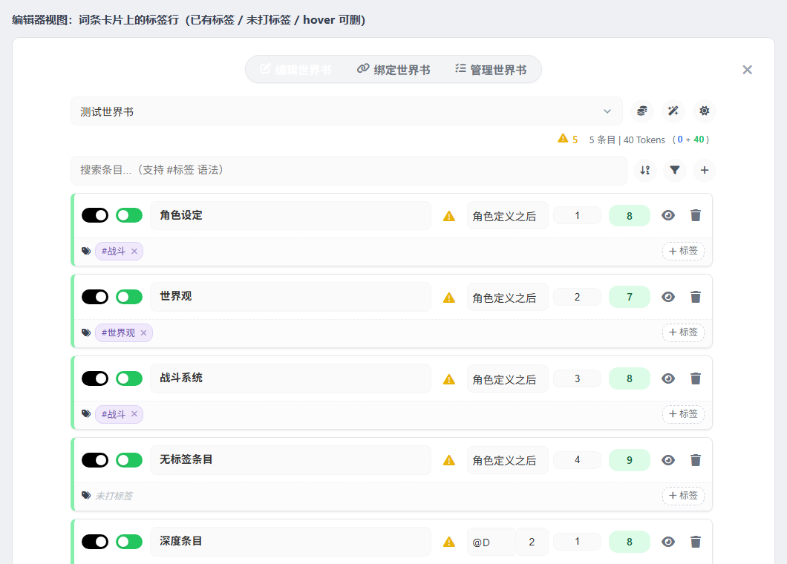
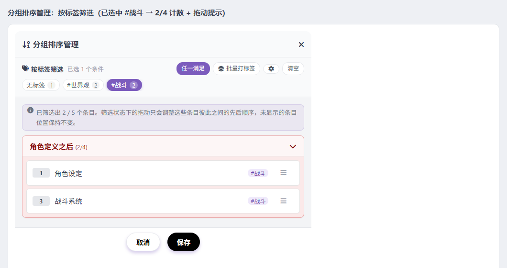
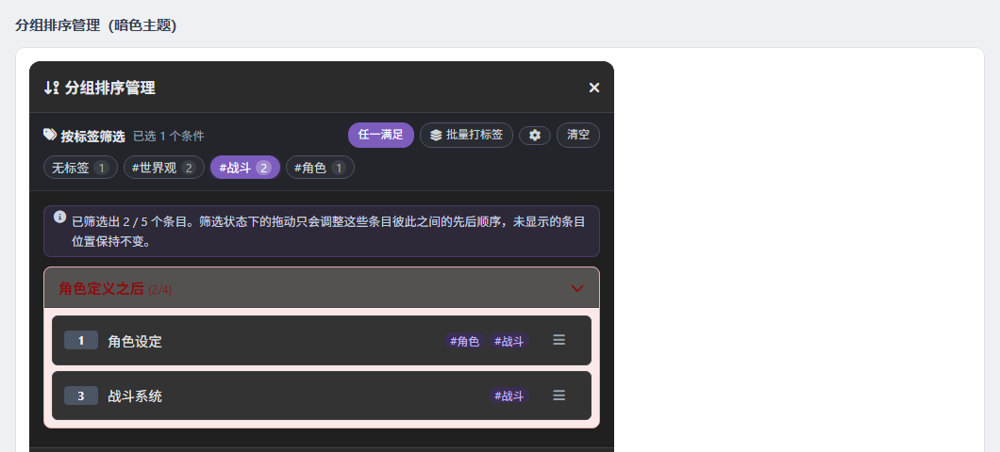
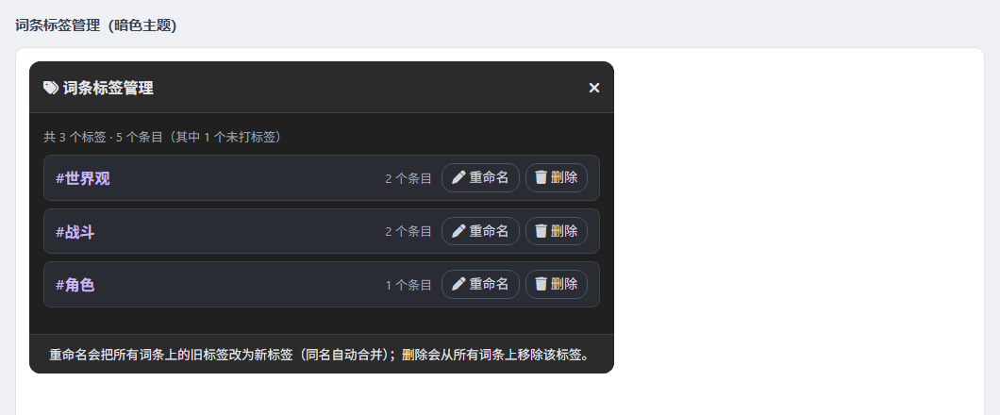
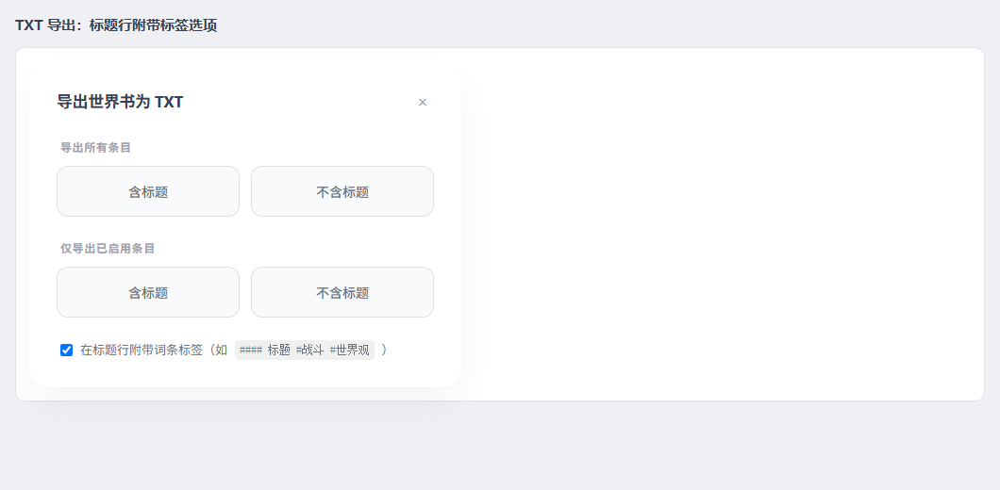

# 世界书管理器 WorldbookEditor · 插件分析 & 词条标签（TAG）新功能

> 本仓库是酒馆（SillyTavern）第三方扩展「世界书管理器」。
> 本次改动在原有插件基础上新增了两项能力：
> **① 给世界书「词条」打标签（TAG）**；**② 在「分组排序管理」里按标签筛选**。
>
> 原始版本：`2.5.0` → 本次版本：`2.6.0`

---

## 一、插件分析

### 1.1 文件结构与职责

| 文件 | 行数* | 职责 |
| --- | --- | --- |
| `manifest.json` | 28 | 扩展清单（名称、入口 `index.js`、样式 `style.css`、版本号） |
| `index.js` | 58 | 入口：在 `#options .options-content` 注入「世界书」按钮，等待 `APP_READY` 后调用 `Actions.init()` |
| `state.js` | 67 | 全局 `CONFIG`（面板 id / 设置 key / 主题色）、`STATE`（当前视图、词条、元数据、绑定、缓存）、`WI_POSITION_MAP` 位置映射 |
| `api.js` | 482 | SillyTavern 接口封装：世界书读写、角色/全局/聊天绑定、重命名与绑定迁移、世界书级元数据、绑定关系缓存 |
| `actions.js` | 815 | 业务动作：初始化与刷新、视图切换、词条增删改、批量操作、排序、导入导出、主题、标签相关动作 |
| `ui.js` | 3489 | 全部渲染与交互：主面板、词条卡片、绑定视图、管理视图、分组排序弹窗、分析/上下文预览/日志/警告等弹窗 |
| `logger.js` | 72 | 带时间戳与级别的日志缓存（供日志查看弹窗使用） |
| `style.css` | 3964 | 面板与所有弹窗样式，含 `[data-theme='dark']` 暗色覆盖 |
| `tags.js` | 256 | **本次新增**：词条标签（TAG）的规范化、读写、统计、筛选与 `#标签` 搜索语法 |

\* 行数为本次改动后的统计。

### 1.2 数据流与关键设计

```
              ┌──────────────┐   事件（SETTINGS_UPDATED / CHAT_CHANGED /
用户操作 ───▶ │  ui.js (UI)  │   CHARACTER_SELECTED / WORLDINFO_UPDATED …）
              └──────┬───────┘         │
                     │ 调用            ▼
              ┌──────▼───────┐  ┌───────────────────┐
              │ actions.js   │◀─│ Actions.init()    │
              │ (业务动作)    │  │ refreshAllContext │
              └──────┬───────┘  └───────────────────┘
                     ▼
              ┌──────────────┐   getContext() / world-info.js
              │   api.js     │─────────────────────────────▶ SillyTavern
              └──────────────┘   loadWorldInfo / saveWorldInfo / 绑定迁移
```

- **元数据分层**：*世界书级*信息（分组、备注、置顶、标签）保存在 `extensionSettings['WorldbookEditor_Metadata']`；*词条级*信息直接写进世界书 `entries`（以 uid 为键），随世界书 JSON 一起保存/导出。
- **排序模型**：词条按 `position`（0–6，对应角色定义前/后、作者注释前/后、@D、示例消息前/后）天然分组，组内再用 `order` 排序，`@D` 还带 `depth`；`Actions.getEntrySortScore()` 把 position+depth 折算成上下文逻辑优先级。
- **性能取舍**：绑定关系用 `boundBooksCache` + 版本号增量更新；角色卡按 30 个一批 `Promise.all` 拉取，且显式放弃了「遍历历史聊天」这一耗时来源；搜索用 `dataset.searchText` 做增量显隐而不是重建 DOM；编辑保存统一 1500ms 防抖，并在关面板/切书/切换视图时 `flushPendingSave()`。
- **可注意的地方**：`ui.js` 单文件近 3000 行、所有弹窗都是字符串拼 HTML；绑定解析兼容了多种角色卡字段（`extensions.world`/`world`/`world_info`/`lorebook`/`character_book`）。

### 1.3 原有功能清单（改动前）

- **编辑世界书**：词条卡片（启用开关 / 蓝绿灯 / 位置菜单 / 顺序 / Token 数 / 内容弹窗编辑关键词与正文）、新建/删除词条、按优先级重排、搜索、警告徽标（绿灯无关键词、未设「不可递归」）、统计与 Token 分析、上下文预览、TXT/JSON 导入导出。
- **绑定世界书**：全局 / 角色主要 / 角色附加 / 当前聊天 四种绑定，双向同步与绑定详情弹窗。
- **管理世界书**：「世界书」分组的绑定视图与「自定义」标签分组视图、顶置、备注、搜索、联动删除、世界书重命名/删除（含绑定迁移）。

---

## 二、新功能：给词条打 TAG

### 2.1 使用方式

在「编辑世界书」视图，每个词条卡片下方新增一行 **标签行**：

| 操作 | 说明 |
| --- | --- |
| 点 `+ 标签` | 展开输入框，输入标签名后 **回车** 或点 ✓ 保存；**ESC** 取消；点别处（失焦）自动保存 |
| 一次输入多个 | 支持 `,` `，` `、` `;` `；` `|` 分隔，例如 `战斗, 主线、高优先级` |
| 点标签本体 | 立刻在搜索框填入 `#标签` 并按该标签筛选词条 |
| 点标签上的 `×` | 从该词条移除该标签（立即写盘） |
| 自动补全 | 输入框绑定 `<datalist>`，候选为当前世界书里已用过的所有标签 |

限制：单个词条最多 **10** 个标签，单个标签最长 **24** 字符；名称自动去首尾空白、压缩内部空白、去掉 `#` 前缀、忽略大小写去重。

### 2.2 标签管理（重命名 / 合并 / 删除）

「管理世界书」→「自定义」的 **管理标签** 是*世界书级*标签；本次新增的是*词条级*标签，入口在 **分组排序管理 → 齿轮按钮**：

- **重命名**：把全书所有词条上的旧标签改成新标签，若新名字已存在则自动合并去重（例如把 `系统` 改名成 `战斗`，不会产生重复标签）。
- **删除**：从所有词条上移除该标签。
- 顶部显示 `共 N 个标签 · M 个条目（其中 K 个未打标签）`。

### 2.3 搜索框支持 `#标签`

- `#战斗` → 只看带「战斗」标签的词条（多个 `#标签` 为「同时满足」）。
- 普通关键词仍然匹配标题与正文，**同时也能命中标签名**。
- 搜索框占位文字已更新为 `搜索条目...（支持 #标签 语法）`。

### 2.4 TXT 导出附带标签

「分析与统计 → 导出世界书为 TXT」弹窗新增勾选项 **在标题行附带词条标签**：

```
#### 战斗系统 #战斗 #系统
战斗系统 的内容
```

JSON 导出无需改动：标签本身就是词条字段，导出即带。

### 2.5 数据存储与兼容性

标签写进词条对象的 `tags: string[]` 字段，例如：

```json
{
  "0": {
    "uid": 0, "comment": "战斗系统", "key": ["k0"], "content": "...",
    "tags": ["战斗", "系统"]
  }
}
```

- **与 SillyTavern 原生编辑器共存**：已核对 ST `public/scripts/world-info.js`，原生世界书编辑器只逐字段覆写自己认识的属性（`data.entries[uid][prop] = value`），`saveWorldInfo()` 也不做字段过滤，因此 `tags` 不会被原生编辑器抹掉。
- **导出/导入/复制**：标签随 JSON 走；ST 的「复制词条」`Object.assign(entry, originalData)` 也会一并复制标签。
- **脏数据容错**：`API.loadBook()` 与保存前都会跑一遍规范化（去重、去空、截断、兼容旧版 `extensions.tags`）；删掉最后一个标签时写回 `[]`，避免旧标签残留。
- **未知字段安全**：`tags` 与 ST 现有字段（`key`/`order`/`group`/`extensions`…）都不冲突。

---

## 三、新功能：「分组排序管理」按 TAG 筛选

打开「编辑世界书 → 分组排序管理」，弹窗顶部新增 **按标签筛选** 区。

| 控件 | 作用 |
| --- | --- |
| 标签胶囊（显示 `#标签` + 使用次数） | 点击选中/取消；选中后高亮为紫色 |
| `无标签` 胶囊 | 专门筛出没打过标签的词条 |
| `任一满足 / 全部满足` | 切换多标签的匹配方式：命中任一标签（OR）或同时满足全部标签（AND） |
| `批量打标签` | 给**当前筛选出的**条目统一添加标签（可用逗号输入多个） |
| 齿轮 | 打开词条标签管理（重命名/合并/删除） |
| `清空` | 清空标签筛选，回到全部条目 |

筛选生效时：

- 只渲染命中的条目，分组标题显示 `(命中数/该组总数)`，无命中的分组自动隐藏；
- 顶部出现提示条：`已筛选出 X / Y 个条目。筛选状态下的拖动只会调整这些条目彼此之间的先后顺序，未显示的条目位置保持不变。`；
- 每条排序项右侧显示该词条自身的 `#标签`，方便核对；
- 全部无命中时给出空状态提示。

**筛选状态下的拖动排序**：拖动只在被筛选出的条目之间生效。实现上把整组的 order 槽位固定，未显示的条目留在原槽位，只把筛选出的条目按新顺序填回它们原本占据的槽位，最后统一重排 `order`——既尊重拖动结果，又不会打乱被隐藏条目的顺序。

筛选条件在**同一本世界书内**会跨弹窗保留；**切换世界书或标签被删除时自动清理**，避免出现「列表空了却看不出原因」。

---

## 四、改动清单

| 文件 | 改动 |
| --- | --- |
| `tags.js` | **新增**：标签规范化/解析、词条标签读写、增删改、统计、标签筛选、`#标签` 搜索语法 |
| `state.js` | 新增 `STATE.entryTagFilter`（筛选条件与匹配模式） |
| `api.js` | `loadBook()` 规范化标签；`saveBookEntries()` 保存前清理 |
| `actions.js` | `updateEntry()` 搜索缓存含标签；新增 `addEntryTag / removeEntryTag / renameEntryTag / deleteEntryTag / batchAddEntryTag / getEntryTagStats / getUntaggedEntryCount / applyVisibleOrder`；TXT 导出标签选项；切换世界书时重置筛选 |
| `ui.js` | 词条卡片标签行 + 输入框 + 事件委托；`renderList` 支持 `#标签` 与强制重建；`initSortableGroup` 支持自定义排序回调；分组排序弹窗标签筛选条/批量打标签/筛选态拖动；标签管理弹窗；TXT 导出勾选项 |
| `style.css` | 新增约 180 行（标签行/胶囊/筛选条/标签管理/暗色适配） |
| `manifest.json` | 版本 `2.5.0` → `2.6.0` |
| `tests/` | **新增**：jsdom 无头测试夹具（121 项断言）+ 可视化预览生成器 |

---

## 五、测试与验证

### 5.1 运行测试

```bash
cd tests
npm install          # 只需一次（安装 jsdom）
node run-tests.mjs   # 或 npm test
```

夹具会把插件源码复制到一份**与 SillyTavern 完全一致的目录结构**中：

```
tests/.harness/
  script.js                                    ← 模拟 ST `/script.js`
  scripts/extensions.js / world-info.js / utils.js
  scripts/extensions/third-party/WorldbookEditor/   ← 插件源码副本
```

这样 `../../../extensions.js`、`../../../../script.js` 等相对导入能被正确解析，测试可以真正加载 `ui.js / actions.js / api.js`，用 jsdom 驱动**真实 DOM 事件**（点击、回车、失焦、拖拽 `dragstart/dragend`），并断言写回「磁盘」（模拟的 `saveWorldInfo`）。

覆盖范围（121 项断言全部通过）：

1. `tags.js` 纯函数：规范化、多分隔符解析、去重、上限、增删改、统计、筛选、`#标签` 解析；
2. `applyVisibleOrder`：筛选态拖动的槽位填充算法；
3. API 层：标签读写的规范化、SillyTavern 原生编辑器改动后标签仍在；
4. 编辑器交互：展开输入框、回车写入、失焦自动保存、ESC 取消、`×` 删除、删除最后一个标签写回 `[]`、重复标签被拒绝；
5. 搜索框 `#标签` 语法与普通关键词；
6. 排序弹窗：胶囊计数、单/多标签筛选、OR↔AND 切换、空结果、批量打标签、清空、`无标签` 筛选；
7. 筛选态拖动排序（DOM 级）：可见条目互换、隐藏条目保持槽位、其它分组不受影响、序号标签更新、保存后与内存一致；
8. 标签管理：重命名合并、删除、与编辑器/筛选条同步；
9. 导出：JSON 带标签、TXT 勾选后标题行带标签；
10. 回归：原有卡片控件、搜索、空世界书场景；
11. 状态同步：标签被删除后筛选条件自动清理、切换世界书重置筛选。

### 5.2 可视化预览

```bash
node run-tests.mjs --preview     # 生成 tests/preview-*.html
```

生成的静态页面内联了 `style.css` 与真实渲染出来的 DOM，可以直接在浏览器里核对样式（明/暗两套）：

| 预览 | 界面 |
| --- | --- |
|  | 编辑器：词条卡片标签行 |
|  | 分组排序管理：按标签筛选（选中 `#战斗`） |
|  | 暗色主题下的筛选条 |
|  | 词条标签管理（暗色） |
|  | TXT 导出附带标签选项 |

> 说明：截图来自测试夹具生成的静态预览页，并非真实 SillyTavern 界面截图（夹具不含酒馆主题变量），仅用于核对新增控件的布局与配色。

---

## 六、已知限制

- 未在真实 SillyTavern 实例中跑过（本环境无酒馆运行时）；已用模拟 ST 模块的 jsdom 夹具覆盖逻辑与交互，并对照 ST 源码确认自定义词条字段会被保留。
- 词条标签是「世界书内」概念，没有跨世界书的全局标签库；跨书统一命名需要手动保持一致。
- 单个词条最多 10 个标签、单标签最长 24 字符（可在 `tags.js` 顶部的常量调整）。
- 筛选状态下的拖动只在被筛选条目之间生效，这是刻意选择（避免隐藏条目的顺序被意外打乱）。
